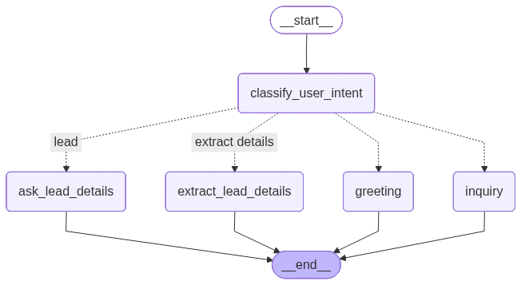

# AutoStream AI - Intelligent Sales & Lead Gen Agent


**AutoStream AI** is a stateful conversational agent designed to automate the sales process for a SaaS video platform. Unlike simple chatbots, it uses a directed graph architecture to actively guide users from casual inquiries to signed-up leads.

---

## Features

* **Intelligent Intent Detection**: Dynamically classifies user input into categories (Greeting, Inquiry, High-Intent Lead) to route the conversation effectively.
* **RAG (Retrieval-Augmented Generation)**: Answers specific product questions (pricing, features, policies) by retrieving data from a local knowledge base (`knowledgeBase.json`).
* **Active Lead Capture**: Identifies high-intent users and collect their Name, Email, and Platform.
* **Contextual Memory**: Remembers conversation history across turns using LangGraph's memory, allowing for natural, multi-turn dialogue.
* **Modular Architecture**: Built with a clean `src/` structure, separating logic for vector storage, graph nodes, and configuration.

---

## Project Structure

```text
autostream-bot/
│
├── data/
│   └── knowledgeBase.json       # Source of truth for RAG (Pricing, Policies)
│
├── src/                         # Application Source Code
│   ├── __init__.py
│   ├── config.py                # Environment variables & paths
│   ├── vector_store.py          # ChromaDB initialization & embedding logic
│   ├── retriever.py             # RAG retrieval logic
│   ├── nodes.py                 # Core agent functions (LLM calls)
│   ├── state.py                 # StateGraph definitions & routing
│   └── graph.py                 # Graph compilation
│
├── main.py                      # Application entry point
├── requirements.txt             # Python dependencies
├── .env                         # API Keys (Not included in repo)
└── README.md                    # Project documentation
```

## Installation & Setup

### 1. Prerequisites
- Python 3.10 or higher
- A Google Cloud API Key (for Gemini)

### 2. Clone the Repository

```bash
git clone https://github.com/fahadNoufal/AutoStream-AI-Agent.git
cd autostream-bot
```

### 3. Create a Virtual Environment (Recommended)

```bash
# Create virtual environment
python -m venv venv

# Activate it (Linux/Mac)
source venv/bin/activate

# Activate it (Windows)
venv\Scripts\activate
```

### 4. Install Dependencies

```bash
pip install -r requirements.txt
```

### 5. Configure Environment Variables
Create a file named .env in the root directory and add your Google API key:

```
GOOGLE_API_KEY=your_google_api_key_here
```

## Usage

Run the main script to start the interactive CLI bot:

```bash
python main.py
```

Note: The first time you run this, it will automatically:

1. Initialize the ChromaDB vector store.
2. Ingest the data from data/knowledgeBase.json.
3. Generate embeddings locally (this may take a few seconds).

Example Interaction:

```
You: hi there
Bot: Hello! 👋 Welcome to AutoStream! We save creators hours on video editing. Want to sign up for a free account and see how it works?

You: befor that i need to know how much your base plan cost
Bot: The Basic Plan is $29 per month. With it, you get 720p resolution, which is great for standard quality viewing, a limit of 10 videos, and standard email support. Ready to try it out?

You: what if i wasnt satisfied
Bot: We want you to be happy with AutoStream! If you're not satisfied, we offer a refund within the first 7 days of your subscription. This gives you a chance to really explore the platform and see if it meets your needs. Ready to sign up?

You: shure
Bot: Awesome! To get you all set up, what's your name, email (or contact number), and which platform do you create content on?

You: i am fahad Noufal 
Bot: Could you please provide your contact, platform to complete the signup?

You: email is examplemail@gmail.com and i create for youtube
Bot: Successfully signed-up! Welcome to AutoStream.

Lead captured successfully: fahad Noufal, examplemail@gmail.com, youtube
```

## Architecture Explained

This project uses **LangGraph** to manage the conversation flow as a flexible state machine, avoiding rigid loops.



#### Design Philosophy:
Non-Blocking Flows Instead of trapping users in a rigid data-collection loop, this architecture re-evaluates user intent at every turn. This allows for non-linear conversations: users can pause the sign-up process to ask clarifying questions ("Is it free?") and resume seamlessly. This mimics human interaction, reduces frustration, and increases the likelihood of lead conversion by addressing doubts in real-time.

1.  **START**: User input is received.
2.  **Classify Intent**: At **every turn**, the `classify_user_intent` node analyzes the text and dynamically routes to one of four paths:
    * **Greeting**: Handles casual hellos and opens the conversation.
    * **Inquiry**: Uses **RAG** (ChromaDB + Gemini) to answer specific questions based on the JSON knowledge base.
    * **Lead**: Identifies high-intent users expressing interest in signing up.
    * **Extract Details**: parses user input to capture specific data slots (Name, Email, Platform). [design philosophy explained below]
3.  **Memory**: The graph utilizes `MemorySaver` to persist the conversation state, ensuring the bot remembers context (like a name mentioned earlier) even if the topic changes.
4. **Trigger Actions**: User lead information is recieved, it triggers a lead_captured function call.

## Customization

- Change the Knowledge Base: Edit data/knowledgeBase.json to update pricing, plans, or policies. Delete the vector-db folder to force a rebuild on the next run.

- Switch LLM: Open src/config.py to change the model (e.g., from gemini-2.0-flash to gpt-4o via LangChain).

- Adjust Prompts: All system prompts are located in src/nodes.py.


## Architecture Explanation 

#### Why langGraph

Because actual user conversations are not linear. A user may begin registering, pause to enquire about pricing, and then pick up where they left off. This back-and-forth is difficult for traditional chain-based frameworks, which frequently require a restart.

LangGraph enables us to control the state of the conversation, direct various user inputs to the appropriate action (such as retrieving pricing information or extracting user details), and seamlessly carry on the conversation without interfering with its flow.

Here, "Conditional Edges" (the route_based_on_intent function) are used to decide the next step dynamically based on the user's latest input, rather than following a hard-coded script. This allows the bot to switch between responding to enquiries and gathering information based solely on the user's current needs.

#### How State is managed?

State is managed by LangGraph using a shared 'State' object and built-in persistence. The State acts as the central memory that flows through all nodes in the graph. During each step, nodes can read from the State (such as messages, user intent, or extracted user details) and update it as needed.

For memory across multiple user turns, LangGraph’s MemorySaver is used as a checkpointer and pass a unique thread_id with each user message. After every step, LangGraph saves the updated State under that thread ID. When the same user sends another message, the saved State is reloaded and the conversation continues from where it left off.

This approach allows the system to remember previous interactions, like a user’s name or earlier questions—without manually passing data between functions, ensuring smooth and consistent conversations.


## WhatsApp Deployment

To integrate this agent with WhatsApp using Webhooks, we would use a service like Twilio or the Meta WhatsApp Cloud API to connect WhatsApp and our Python backend. First, we wrap our agent inside a lightweight web server using FastAPI and expose a public endpoint (eg: https://api-name/whatsapp). This endpoint acts as our webhook listener.

Next, we configure Twilio or the Meta API to send a POST request to this webhook whenever a WhatsApp user sends a message. The request contains the user’s phone number and message text. Inside the webhook handler, we extract the message content and use the phone number as the thread_id when invoking the LangGraph agent. This ensures each WhatsApp user has their own isolated conversation state and memory.

After our agent processes the message and generates a response, server sends that response back to Twilio or the Meta API, which then delivers it to the user on WhatsApp. This webhook-based approach is efficient, scalable, and allows the agent to maintain conversation continuity across multiple messages.